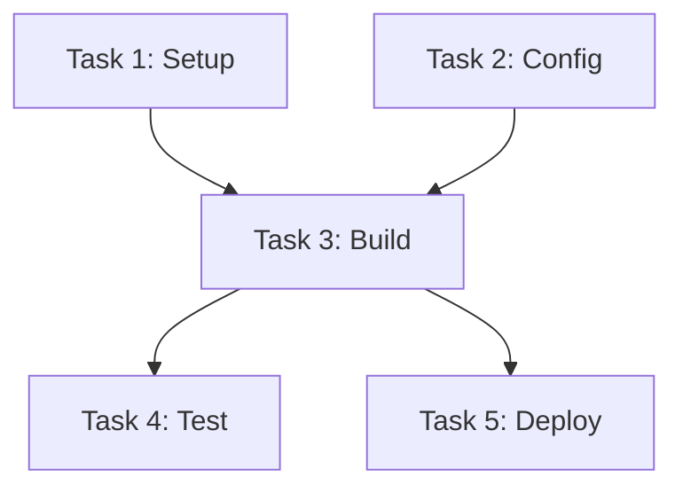

# Epic 02: Dependency Resolution System

**Priority:** P0 (Critical Path)
**Estimated Duration:** 2-3 days
**Dependencies:** Epic 01 (Foundation)
**Phase:** 1

---

## Overview

Implement Kahn's algorithm for topological sorting of tasks based on their dependencies. This enables safe parallel execution by identifying which tasks can run concurrently and which must wait for others.

---

## Background: Kahn's Algorithm

Kahn's algorithm finds a topological ordering of a directed acyclic graph (DAG):

1. Compute in-degree (number of incoming edges) for each node
2. Add all nodes with in-degree 0 to a queue
3. While queue not empty:
   - Remove node from queue, add to result
   - For each neighbor, decrement in-degree
   - If neighbor's in-degree becomes 0, add to queue
4. If result size < node count, cycle detected

For parallel batching, we modify step 3 to process the entire queue as one batch.

---

## Tasks

### 2.1 DependencyResolver Core Implementation

**Description:** Implement the core dependency resolution algorithm.

**File:** `core/parallel/dependency_resolver.py`

**Classes:**

```python
@dataclass
class DependencyGraph:
    """Result of dependency resolution"""
    batches: List[List[int]]           # Tasks grouped by dependency level
    task_order: List[int]              # Topologically sorted task IDs
    circular_deps: List[Set[int]]      # Detected circular dependencies
    missing_deps: List[Tuple[int, int]]  # (task_id, missing_dep_id)
    epic_groups: List[List[int]]       # Alternative: tasks grouped by epic

class DependencyResolver:
    """
    Resolves task dependencies using Kahn's algorithm.

    Produces parallel batches where:
    - All tasks in a batch have satisfied dependencies
    - Batches execute sequentially
    - Tasks within a batch execute in parallel
    """

    def resolve(self, tasks: List[Dict], epics: List[Dict]) -> DependencyGraph:
        """Main resolution method"""

    def get_epic_parallel_groups(self, tasks, epics) -> List[List[int]]:
        """Alternative: Group by epic for epic-level parallelization"""

    def validate_dependencies(self, tasks) -> List[str]:
        """Validate dependency declarations, return errors"""

    def get_blocking_tasks(self, task_id, tasks) -> List[int]:
        """Get list of tasks that block the given task"""

    def get_dependent_tasks(self, task_id, tasks) -> List[int]:
        """Get list of tasks that depend on the given task"""
```

**Algorithm Details:**

```python
def resolve(self, tasks: List[Dict], epics: List[Dict]) -> DependencyGraph:
    task_map = {t['id']: t for t in tasks}
    epic_map = {e['id']: e for e in epics}

    # Build adjacency list and in-degree map
    adj_list = defaultdict(list)  # task -> [dependents]
    in_degree = defaultdict(int)
    missing_deps = []

    for task in tasks:
        task_id = task['id']
        depends_on = task.get('depends_on', []) or []

        # Also inherit epic dependencies
        epic = epic_map.get(task['epic_id'], {})
        epic_deps = epic.get('depends_on', []) or []

        # Convert epic deps to task deps (last task of each epic)
        for epic_dep_id in epic_deps:
            dep_epic_tasks = [t for t in tasks if t['epic_id'] == epic_dep_id]
            if dep_epic_tasks:
                # Depend on all tasks in the epic
                depends_on.extend([t['id'] for t in dep_epic_tasks])

        for dep_id in depends_on:
            if dep_id not in task_map:
                missing_deps.append((task_id, dep_id))
                continue
            adj_list[dep_id].append(task_id)
            in_degree[task_id] += 1

    # Initialize with zero in-degree tasks
    queue = deque()
    for task_id in task_map:
        if in_degree[task_id] == 0:
            queue.append(task_id)

    # Process in batches
    batches = []
    task_order = []
    processed = set()

    while queue:
        # Current batch = all tasks currently in queue
        batch = sorted(queue, key=lambda tid: (
            task_map[tid].get('priority', 999),
            epic_map.get(task_map[tid]['epic_id'], {}).get('priority', 999),
            tid
        ))

        for task_id in batch:
            task_order.append(task_id)
            processed.add(task_id)

            for dependent_id in adj_list[task_id]:
                in_degree[dependent_id] -= 1

        # Prepare next batch
        next_queue = deque()
        for task_id in task_map:
            if task_id not in processed and in_degree[task_id] == 0:
                next_queue.append(task_id)

        if batch:
            batches.append(batch)
        queue = next_queue

    # Detect circular dependencies
    circular_deps = []
    if len(processed) < len(task_map):
        unprocessed = set(task_map.keys()) - processed
        circular_deps.append(unprocessed)

    return DependencyGraph(
        batches=batches,
        task_order=task_order,
        circular_deps=circular_deps,
        missing_deps=missing_deps,
        epic_groups=self.get_epic_parallel_groups(tasks, epics)
    )
```

**Acceptance Criteria:**
- [ ] Correctly identifies independent tasks (batch 1)
- [ ] Correctly orders dependent tasks
- [ ] Detects circular dependencies
- [ ] Reports missing dependency references
- [ ] Handles empty dependency lists
- [ ] Priority ordering within batches

---

### 2.2 Dependency Visualization

**Description:** Generate visual representation of dependency graph.

**Methods:**

```python
def to_mermaid(self, tasks: List[Dict]) -> str:
    """Generate Mermaid diagram of dependencies"""

def to_ascii(self, tasks: List[Dict]) -> str:
    """Generate ASCII representation for CLI"""

def get_critical_path(self, tasks: List[Dict]) -> List[int]:
    """Identify the critical path (longest dependency chain)"""
```

**Example Mermaid Output:**



**Acceptance Criteria:**
- [ ] Valid Mermaid syntax generated
- [ ] ASCII representation readable
- [ ] Critical path correctly identified

---

### 2.3 Session 0 Dependency Prompt Integration

**Description:** Modify Session 0 prompt to request dependency declarations.

**Prompt Addition:**

```markdown
## Task Dependencies

When creating tasks, consider dependencies between them:

- If Task B requires Task A to complete first, declare: `depends_on: [task_id_of_A]`
- Dependencies can be:
  - **Hard**: Must complete before starting (default)
  - **Soft**: Should complete but can proceed

### Dependency Declaration Format

When creating a task that depends on another:

```json
{
  "description": "Implement login endpoint",
  "depends_on": [123, 124],
  "dependency_type": "hard"
}
```

### Common Dependency Patterns

1. **Schema before API**: Database schema tasks before API endpoints
2. **API before UI**: Backend endpoints before frontend components
3. **Core before Features**: Shared utilities before feature implementations
4. **Implementation before Tests**: Feature code before test code
```

**Files to Modify:**
- `prompts/initializer_prompt_local.md`
- `prompts/initializer_prompt_docker.md`

**Acceptance Criteria:**
- [ ] Prompt includes dependency instructions
- [ ] Agent generates dependency declarations
- [ ] Dependencies parsed correctly from output

---

### 2.4 Dependency Parsing from Agent Output

**Description:** Parse dependency declarations from Session 0 agent output.

**File:** `core/parallel/dependency_parser.py`

**Functions:**

```python
def parse_dependencies_from_task(task_json: Dict) -> List[int]:
    """Extract depends_on from task creation call"""

def infer_dependencies(tasks: List[Dict]) -> Dict[int, List[int]]:
    """Infer dependencies from task descriptions using heuristics"""

def validate_parsed_dependencies(tasks: List[Dict], deps: Dict) -> List[str]:
    """Validate parsed dependencies, return warnings"""
```

**Inference Heuristics:**

```python
DEPENDENCY_PATTERNS = [
    # Pattern: "after X", "following X", "once X is complete"
    (r'after (?:task )?(\d+)', 'explicit_reference'),
    (r'following (?:task )?(\d+)', 'explicit_reference'),
    (r'once (?:task )?(\d+) is complete', 'explicit_reference'),

    # Pattern: "requires X", "depends on X"
    (r'requires (?:task )?(\d+)', 'explicit_reference'),
    (r'depends on (?:task )?(\d+)', 'explicit_reference'),

    # Semantic patterns
    (r'database schema', 'schema_first'),
    (r'api endpoint', 'after_schema'),
    (r'frontend component', 'after_api'),
    (r'test for', 'after_implementation'),
]
```

**Acceptance Criteria:**
- [ ] Parses explicit dependency declarations
- [ ] Infers dependencies from descriptions
- [ ] Validates dependency consistency
- [ ] Handles missing references gracefully

---

### 2.5 MCP Tool Updates for Dependencies

**Description:** Update MCP task-manager to support dependencies.

**File:** `mcp-task-manager/src/index.ts`

**Tool Updates:**

```typescript
// Update create_task tool
{
  name: 'create_task',
  inputSchema: {
    // ... existing fields
    depends_on: {
      type: 'array',
      items: { type: 'integer' },
      description: 'List of task IDs this task depends on'
    },
    dependency_type: {
      type: 'string',
      enum: ['hard', 'soft'],
      default: 'hard'
    }
  }
}

// New tool: get_dependency_graph
{
  name: 'get_dependency_graph',
  description: 'Get the dependency graph for all tasks in the project',
  inputSchema: {
    type: 'object',
    properties: {
      format: {
        type: 'string',
        enum: ['json', 'mermaid', 'ascii'],
        default: 'json'
      }
    }
  }
}

// New tool: get_parallel_batches
{
  name: 'get_parallel_batches',
  description: 'Get tasks grouped into parallel execution batches',
  inputSchema: {
    type: 'object',
    properties: {}
  }
}
```

**Acceptance Criteria:**
- [ ] create_task accepts depends_on parameter
- [ ] Dependencies stored in database
- [ ] get_dependency_graph returns correct graph
- [ ] get_parallel_batches returns correct batches

---

### 2.6 API Endpoints for Dependencies

**Description:** Add REST API endpoints for dependency management.

**Endpoints:**

```python
@app.get("/api/projects/{project_id}/dependencies")
async def get_dependency_graph(project_id: str, format: str = "json"):
    """Get the full dependency graph"""

@app.get("/api/projects/{project_id}/dependencies/batches")
async def get_parallel_batches(project_id: str):
    """Get tasks grouped into parallel batches"""

@app.get("/api/projects/{project_id}/dependencies/critical-path")
async def get_critical_path(project_id: str):
    """Get the critical path through the dependency graph"""

@app.post("/api/projects/{project_id}/tasks/{task_id}/dependencies")
async def set_task_dependencies(project_id: str, task_id: int, body: Dict):
    """Set dependencies for a task"""

@app.get("/api/projects/{project_id}/dependencies/validate")
async def validate_dependencies(project_id: str):
    """Validate all dependencies, return errors"""
```

**Acceptance Criteria:**
- [ ] All endpoints return correct data
- [ ] Error handling for invalid requests
- [ ] Mermaid format option works

---

## Testing Requirements

### Unit Tests

```python
class TestDependencyResolver:
    def test_no_dependencies(self):
        """All tasks independent - single batch"""

    def test_linear_dependencies(self):
        """A -> B -> C - three batches"""

    def test_parallel_branches(self):
        """A -> B, A -> C, B -> D, C -> D"""

    def test_circular_dependency_detection(self):
        """A -> B -> C -> A"""

    def test_missing_dependency_reference(self):
        """A depends on non-existent B"""

    def test_priority_ordering_within_batch(self):
        """Higher priority tasks first in batch"""

    def test_epic_dependency_inheritance(self):
        """Tasks inherit epic-level dependencies"""
```

### Integration Tests

```python
class TestDependencyIntegration:
    def test_session_0_generates_dependencies(self):
        """Session 0 creates tasks with dependencies"""

    def test_mcp_tools_handle_dependencies(self):
        """MCP tools correctly store dependencies"""

    def test_api_returns_correct_batches(self):
        """API endpoints return correct batch structure"""
```

---

## Dependencies

- Epic 01: Foundation (database schema with depends_on columns)

## Dependents

- Epic 04: Parallel Executor (needs batch computation)

---

## Notes

- Consider caching computed batches (invalidate on task changes)
- May need to re-compute batches if dependencies change mid-execution
- Circular dependency should prevent project execution, not just warn
